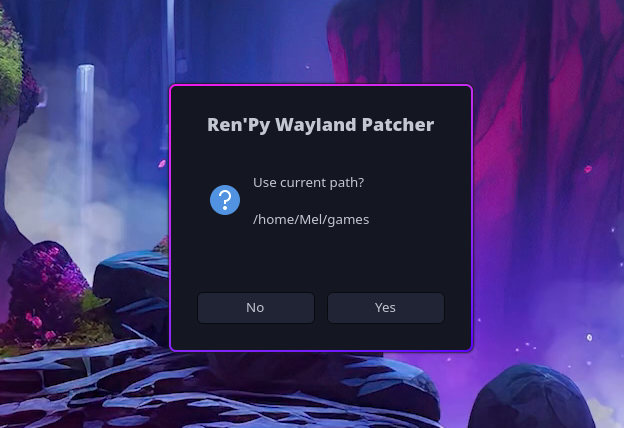
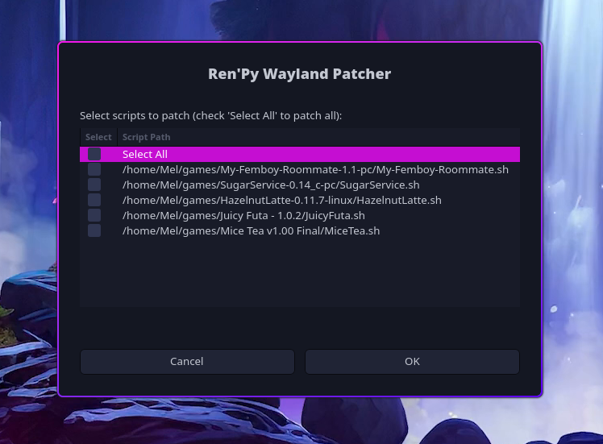
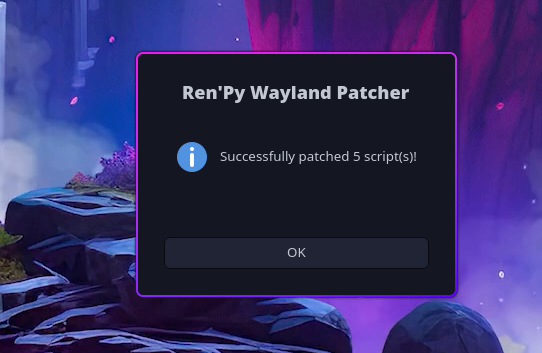

# RenPy-Wayland-Patcher
A simple GUI script for automatically adding the line "export SDL_VIDEODRIVER=x11" to the linux version of renpy games that they require to work under wayland  

## What it does

THis script searches in either the folder it is in, or a user entered folder for .sh files of Ren'py games.  
it then lists the sh files that do not contain the patch required to make them run under wayland, and allows you to select what files to patch.  
the patch itself defines the the SDL videodriver to be xwayland, allowing renpy's default linux.sh to work under wayland enviroments 

## Requirements
This program just needs "Zenity" to work properly. most distros come with this pre-installed, otherwise to install it:
#### Debian/ubuntu
`sudo apt install zenity`  
#### Fedora
`sudo dnf install zenity`  
#### Opensuse
`sudo zypper install zenity`  
#### Arch btw
`sudo pacman -S zenity`  
#### Gentoo
`sudo emerge --ask gnome-extra/zenity`
## Installation  

***DONT DOWNLOAD AS A ZIP***, use the release or directly use `git clone https://github.com/MelancholiaaEX/RenPy-Wayland-Patcher.git` in the Terminal. 

### if you do download it as a Zip
extract it  
do `chmod +x RenPyPatcher.sh`

## Usage
Just place the .sh file in the folder you keep all your games in, and run it  
alternatively, you can also just run it from anywhere and select your game folder
